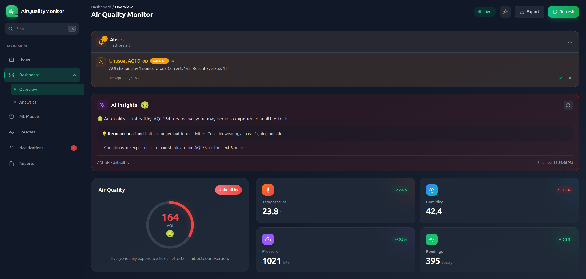
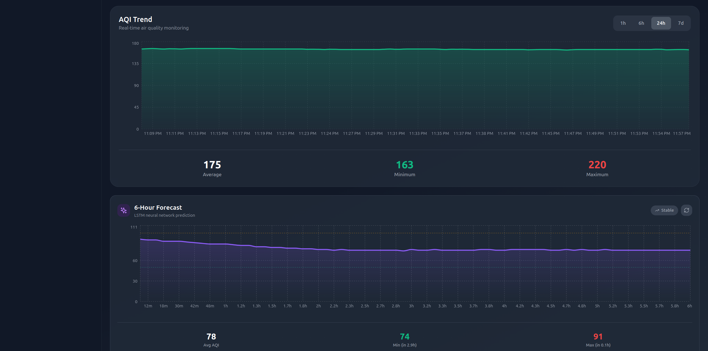
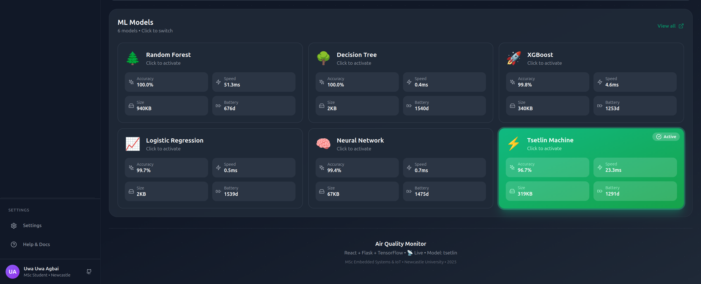

# 🌡️ Air Quality Monitor

> Real-time IoT air quality monitoring system with ML-powered predictions, 6-hour forecasting, and intelligent alerts.


## 📸 Screenshots





## 📖 Overview

A full-stack IoT application that monitors air quality using a BME680 environmental sensor, processes data through 6 different machine learning models, forecasts AQI 6 hours ahead using LSTM neural networks, and provides real-time alerts. Built as a portfolio project demonstrating embedded systems, full-stack development, and edge AI.

## ✨ Features

| Feature | Description |
|---------|-------------|
| 🔴 **Real-time Monitoring** | Live sensor data streaming every 30 seconds |
| 🤖 **6 ML Models** | Compare Decision Tree, Random Forest, XGBoost, Neural Network, Logistic Regression, Tsetlin Machine |
| 📈 **6-Hour Forecasting** | LSTM time-series prediction for AQI trends |
| 🚨 **Smart Alerts** | Threshold, predictive, anomaly, and trend detection |
| 💡 **AI Insights** | Natural language summaries of air quality conditions |
| ⚡ **Energy Profiling** | Battery life estimation for edge deployment |
| 🌙 **Dark/Light Mode** | Automatic theme detection with manual toggle |
| 📊 **Interactive Dashboard** | React-based real-time visualization |

## 🏗️ System Architecture

```
┌─────────────────────────────────────────────────────────────────────────┐
│                         SYSTEM ARCHITECTURE                             │
├─────────────────────────────────────────────────────────────────────────┤
│                                                                         │
│   HARDWARE LAYER                                                        │
│   ┌─────────────┐     ┌─────────────┐                                  │
│   │  BME680     │────▶│  WeMos D1   │                                  │
│   │  Sensor     │I2C  │  ESP8266    │                                  │
│   │             │     │             │                                  │
│   │ • Temp      │     │ • AQI Calc  │                                  │
│   │ • Humidity  │     │ • JSON Out  │                                  │
│   │ • Pressure  │     │             │                                  │
│   │ • Gas (VOC) │     └──────┬──────┘                                  │
│   └─────────────┘            │ USB Serial (115200 baud)                │
│                              ▼                                          │
│   BACKEND LAYER        ┌─────────────┐                                 │
│                        │ Flask API   │                                 │
│                        │             │                                 │
│                        │ • Serial RX │                                 │
│                        │ • ML Infer  │                                 │
│                        │ • Alerts    │                                 │
│                        │ • REST API  │                                 │
│                        └──────┬──────┘                                 │
│                               │                                         │
│   ML LAYER            ┌──────┴──────┐                                  │
│                       │             │                                   │
│              ┌────────┴───┐   ┌─────┴─────┐                            │
│              │ 6 Models   │   │ LSTM      │                            │
│              │            │   │ Forecast  │                            │
│              │ •Dec Tree  │   │           │                            │
│              │ •Rand For  │   │ 6-hour    │                            │
│              │ •XGBoost   │   │ prediction│                            │
│              │ •LogReg    │   │           │                            │
│              │ •Neural    │   └───────────┘                            │
│              │ •Tsetlin   │                                            │
│              └────────────┘                                            │
│                               │                                         │
│   DATABASE             ┌──────┴──────┐                                 │
│                        │  SQLite     │                                 │
│                        │  readings   │                                 │
│                        │  alerts     │                                 │
│                        └──────┬──────┘                                 │
│                               │ REST API                               │
│   FRONTEND             ┌──────┴──────┐                                 │
│                        │   React     │                                 │
│                        │  Dashboard  │                                 │
│                        │             │                                 │
│                        │ • AQI Gauge │                                 │
│                        │ • Charts    │                                 │
│                        │ • Forecast  │                                 │
│                        │ • Alerts    │                                 │
│                        │ • Dark Mode │                                 │
│                        └─────────────┘                                 │
│                                                                         │
└─────────────────────────────────────────────────────────────────────────┘
```

## 🛠️ Tech Stack

### Hardware
- **Microcontroller:** WeMos D1 Mini (ESP8266)
- **Sensor:** BME680 (Temperature, Humidity, Pressure, Gas/VOC)
- **Communication:** I2C (sensor) + USB Serial (to backend)

### Backend
- **Framework:** Flask (Python)
- **Database:** SQLite
- **ML Libraries:** scikit-learn, XGBoost, TensorFlow/Keras, pyTsetlinMachine
- **Serial Communication:** PySerial

### Frontend
- **Framework:** React 18 + Vite
- **Styling:** Tailwind CSS
- **Charts:** Recharts
- **Icons:** Lucide React

### Machine Learning
| Model | Accuracy | Inference | Energy | Battery Life |
|-------|----------|-----------|--------|--------------|
| Random Forest | 100.0% | 62.6ms | 3.84mJ | 676 days |
| **Decision Tree** | **100.0%** | **0.4ms** | **0.004mJ** | **1540 days** |
| XGBoost | 99.8% | 3.6ms | 0.69mJ | 1253 days |
| Logistic Regression | 99.7% | 1.1ms | 0.005mJ | 1539 days |
| Neural Network | 99.4% | 1.3ms | 0.14mJ | 1475 days |
| Tsetlin Machine ⚡ | 96.7% | 23.9ms | 0.58mJ | 1291 days |

> ⚡ **Key Insight:** Decision Tree achieves 100% accuracy with the fastest inference, making it ideal for edge deployment. Tsetlin Machine offers excellent energy efficiency with competitive accuracy - perfect for FPGA implementation.

## 📁 Project Structure

```
air-quality-pro/
├── arduino/                    # Microcontroller firmware
│   └── air_quality_node.ino   # Arduino sketch
│
├── platformio/                 # PlatformIO project
│   ├── platformio.ini
│   └── src/main.cpp
│
├── backend/
│   ├── app.py                 # Flask application
│   ├── database.py            # SQLite operations
│   ├── config.py              # Configuration
│   ├── simulator.py           # Demo mode data generator
│   ├── alerts/
│   │   └── alert_manager.py   # Alert system
│   └── ml/
│       ├── model_manager.py   # ML model loader
│       ├── train_all.py       # Model training script
│       ├── models/            # Model implementations
│       ├── saved_models/      # Trained model files (.pkl)
│       └── forecasting/
│           ├── lstm_model.py  # LSTM forecaster
│           └── train_forecast.py
│
├── frontend/
│   ├── src/
│   │   ├── components/
│   │   │   ├── ModernDashboard.jsx
│   │   │   ├── Sidebar.jsx
│   │   │   ├── AlertPanel.jsx
│   │   │   ├── AIInsights.jsx
│   │   │   ├── ForecastChart.jsx
│   │   │   └── ...
│   │   └── hooks/
│   │       └── useSensorData.js
│   ├── tailwind.config.js
│   └── package.json
│
├── data/
│   └── AirQualityUCI.csv      # Training dataset
│
└── README.md
```

## 🚀 Quick Start

### Prerequisites
- Python 3.10+
- Node.js 18+
- Arduino IDE or PlatformIO (for hardware)

### 1. Clone Repository
```bash
git clone https://github.com/uwaagbai1/air-quality-pro.git
cd air-quality-pro
```

### 2. Backend Setup
```bash
cd backend
python -m venv venv
source venv/bin/activate  # Windows: venv\Scripts\activate
pip install -r requirements.txt

# Train ML models
python ml/train_all.py

# Train forecast model (optional - needs 50+ readings)
python -m ml.forecasting.train_forecast
```

### 3. Frontend Setup
```bash
cd frontend
npm install
```

### 4. Run Application

**With hardware:**
```bash
# Terminal 1 - Backend
cd backend && python app.py

# Terminal 2 - Frontend
cd frontend && npm run dev
```

**Demo mode (no hardware):**
```bash
# Terminal 1 - Backend with simulated data
cd backend && python app.py --demo

# Terminal 2 - Frontend
cd frontend && npm run dev
```

### 5. Open Dashboard
Navigate to `http://localhost:5173`

## 📡 API Endpoints

| Endpoint | Method | Description |
|----------|--------|-------------|
| `/api/health` | GET | Health check |
| `/api/latest` | GET | Latest sensor reading |
| `/api/readings?hours=24` | GET | Historical readings |
| `/api/stats?hours=24` | GET | Aggregated statistics |
| `/api/chart?hours=24` | GET | Chart-formatted data |
| `/api/models` | GET | List available ML models |
| `/api/models/compare` | GET | Model comparison metrics |
| `/api/models/set` | POST | Switch active model |
| `/api/forecast` | GET | 6-hour AQI forecast |
| `/api/forecast/summary` | GET | Hourly forecast summary |
| `/api/alerts/active` | GET | Active alerts |
| `/api/alerts/<id>/acknowledge` | POST | Acknowledge alert |
| `/api/alerts/<id>/dismiss` | POST | Dismiss alert |

## 🔧 Hardware Setup

### Wiring Diagram (BME680 → WeMos D1 Mini)

| BME680 Pin | WeMos Pin | Description |
|------------|-----------|-------------|
| VCC | 3.3V | Power (do NOT use 5V) |
| GND | GND | Ground |
| SCL | D1 (GPIO5) | I2C Clock |
| SDA | D2 (GPIO4) | I2C Data |
| SDO | GND | Address select (0x76) |
| CS | 3.3V | Enable I2C mode |

### Upload Firmware

**Using PlatformIO (recommended):**
```bash
cd platformio
pio run --target upload
pio device monitor  # View serial output
```

**Using Arduino IDE:**
1. Open `arduino/air_quality_node.ino`
2. Select Board: "LOLIN(WeMos) D1 R1"
3. Select Port: `/dev/ttyUSB0` (Linux) or `COM3` (Windows)
4. Click Upload

## 🧠 ML Model Training

### Classification Models
Models are trained on the UCI Air Quality dataset with 4 classes:
- Good (0-50 AQI)
- Moderate (51-100 AQI)
- Unhealthy for Sensitive Groups (101-150 AQI)
- Unhealthy (151-200 AQI)

**Features:** Temperature, Humidity, Gas Resistance

```bash
# Train all 6 models
cd backend
python ml/train_all.py
```

### LSTM Forecasting
The LSTM model predicts AQI 6 hours ahead using:
- **Input:** Last 24 hours of readings (288 data points @ 5-min intervals)
- **Output:** Next 6 hours prediction (72 data points)
- **Architecture:** 2-layer LSTM (64→32 units) with dropout
- **MAE:** ~4 AQI points

```bash
# Train forecast model (needs historical data)
python -m ml.forecasting.train_forecast
```

## 🚨 Alert System

| Alert Type | Trigger | Example |
|------------|---------|---------|
| **Threshold** | AQI crosses EPA levels | "Unhealthy Air Quality" when AQI > 150 |
| **Predictive** | Forecast predicts bad air | "AQI Expected to Reach 180 in 2h" |
| **Anomaly** | Sudden AQI changes | "Unusual AQI Spike" (>3 std dev) |
| **Trend** | Sustained worsening | "Air Quality Worsening (30%↑)" |

## 🎯 Key Achievements

- ✅ **Real Hardware Integration** - BME680 sensor with ESP8266
- ✅ **6 ML Models Compared** - Accuracy, latency, energy, battery life
- ✅ **Tsetlin Machine** - Novel ML approach for energy-efficient inference
- ✅ **LSTM Forecasting** - 6-hour AQI prediction with ~4 AQI MAE
- ✅ **Intelligent Alerts** - 4 alert types with real-time notifications
- ✅ **Energy Profiling** - Battery life estimation for edge deployment
- ✅ **Full-Stack** - Flask API + React Dashboard
- ✅ **Production Ready** - Error handling, dark mode, responsive UI

## 🔮 Future Enhancements

- [ ] FPGA acceleration for Tsetlin Machine inference
- [ ] Multi-node sensor network
- [ ] Docker containerization
- [ ] Mobile app (React Native)
- [ ] Cloud sync & historical analytics

## 👨‍💻 Author

**Uwa Uwa Agbai**
- MSc Embedded Systems & IoT, Newcastle University
- Research: Energy-Efficient AI Hardware
- [LinkedIn](https://linkedin.com/in/uwaagbai)
- [GitHub](https://github.com/uwaagbai1)

## 📄 License

MIT License - feel free to use for your own projects!

---

<p align="center">
  Built with ❤️ using React, Flask, TensorFlow, and Real IoT Hardware
</p>